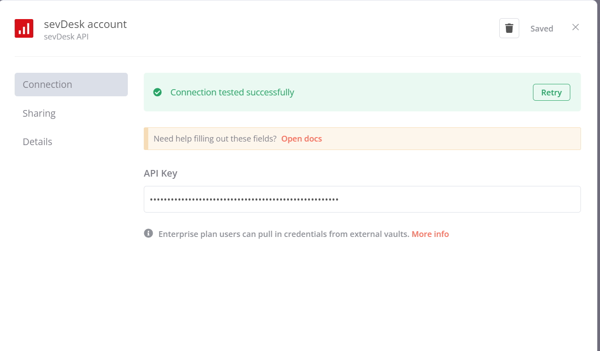

# n8n-nodes-sevdesk-v2

[](https://www.npmjs.com/package/n8n-nodes-sevdesk-v2)
[](https://www.npmjs.com/package/n8n-nodes-sevdesk-v2)
[](https://github.com/knackw/n8n-nodes-sevdesk-v2/actions)
[](https://github.com/knackw/n8n-nodes-sevdesk-v2/blob/main/LICENSE)

This is an n8n community node that provides comprehensive integration with the SevDesk API v2. SevDesk is a popular accounting tool based in Germany. You'll find more information on their [website](https://sevdesk.de/).

[n8n](https://n8n.io/) is a [fair-code licensed](https://docs.n8n.io/reference/license/) workflow automation platform.

## 🚀 Features

- **Full CRUD Operations** for all major SevDesk entities
- **API v2 Support** with backward compatibility to v1
- **Comprehensive Filtering** and search capabilities
- **File Upload/Download** support for documents
- **Batch Operations** for efficient data processing
- **Error Handling** with detailed feedback
- **Comprehensive Testing** with Jest and coverage reporting
- **CI/CD Pipeline** with automated testing and deployment
- **Code Quality Tools** with Husky and lint-staged

## 📋 Supported Resources

### ✅ Fully Implemented
- **Contacts** - Complete contact management with addresses and custom fields
- **Invoices** - Full invoice lifecycle including PDF generation and email sending
- **Orders** - Order management with positions and discounts
- **Vouchers** - Receipt management with file attachments
- **Parts** - Inventory management with stock tracking
- **Banking** - Check accounts and transactions
- **Tags** - Flexible tagging system
- **Reports** - PDF report generation

### 🔄 In Progress
- **Credit Notes** - Credit note management
- **Exports** - Data export functionality
- **Layouts** - Document layout management

## 🛠 Installation

Follow the [installation guide](https://docs.n8n.io/integrations/community-nodes/installation/) in the n8n community nodes documentation.

```bash
npm install n8n-nodes-sevdesk-v2
```

## 🔑 Setup

### 1. Get Your API Key
1. Log into your SevDesk account
2. Go to **Settings** → **API**
3. Copy your API key

### 2. Configure Credentials
1. In n8n, go to **Credentials**
2. Add new credential of type **SevDesk API**
3. Enter your API key
4. Choose API version (v2 recommended)
5. Test the connection



## 📖 Usage Examples

### Create a Contact
```json
{
  "resource": "contact",
  "operation": "create",
  "name": "John Doe",
  "customerNumber": "CUST001",
  "category": {
    "id": "1",
    "objectName": "Contact"
  }
}
```

### Get Invoices with Filters
```json
{
  "resource": "invoice",
  "operation": "getMany",
  "filters": {
    "status": "100",
    "createAfter": "2024-01-01",
    "limit": 50
  }
}
```

### Send Invoice via Email
```json
{
  "resource": "invoice",
  "operation": "sendViaEmail",
  "invoiceId": "12345",
  "email": "customer@example.com",
  "subject": "Your Invoice",
  "text": "Please find your invoice attached."
}
```

## 🔧 Configuration

### API Versions
- **v1 (Legacy)**: Original API, still supported
- **v2 (Recommended)**: Latest API with improved features and performance

### Rate Limiting
The node respects SevDesk's rate limits and includes automatic retry logic for failed requests.

## 🧪 Testing

### Running Tests
```bash
# Run all tests
npm test

# Run tests in watch mode
npm run test:watch

# Run tests with coverage
npm run test:coverage
```

### Test Coverage
The project includes comprehensive test coverage for:
- Node functionality
- Credential validation
- API operations
- Error handling

## 🤝 Contributing

Contributions are welcome! Please feel free to submit a Pull Request.

### Development Setup
```bash
git clone https://github.com/knackw/n8n-nodes-sevdesk-v2.git
cd n8n-nodes-sevdesk-v2
npm install
npm run build
```

### Code Quality
The project uses several tools to maintain code quality:
- **ESLint** for code linting
- **Prettier** for code formatting
- **Husky** for git hooks
- **lint-staged** for pre-commit checks

### Pull Request Process
1. Fork the repository
2. Create a feature branch
3. Make your changes
4. Add tests for new functionality
5. Ensure all tests pass
6. Submit a pull request

## 📞 Support

- **Issues**: [GitHub Issues](https://github.com/knackw/n8n-nodes-sevdesk-v2/issues)
- **Documentation**: [SevDesk API Docs](https://api.sevdesk.de/)
- **Community**: [n8n Community](https://community.n8n.io/)
- **Developer Contact**: harald@schwankl.info

## 📚 Documentation

For detailed documentation, see:
- [DOCUMENTATION.md](DOCUMENTATION.md) - Comprehensive guide
- [CHANGELOG.md](CHANGELOG.md) - Version history and changes

## 👨‍💻 Developer

Hi, I'm Harald, an independent consultant passionate about open source software.

My nodes are free to use, but please consider [donating](https://coff.ee/knackw) if you find them helpful.

### Services Offered
- Node Development
- Workflow Development  
- Mentoring
- Support

## 📄 License

[MIT](LICENSE)

## 🙏 Acknowledgments

- [Nico Kowalczyk](https://github.com/nico-kow) - Fundamental work on the original node
- [GitCedric](https://github.com/gitcedric) - Initial n8n integration
- [Bram](https://github.com/bramkn) - Community guidance and README template
- [n8n Team](https://github.com/n8n-io/n8n) - Amazing automation platform

## 📈 Version History

### v0.4.0 (Current)
- ✅ Added API v2 support with backward compatibility
- ✅ Enhanced credential management with API version selection
- ✅ Comprehensive test suite with Jest
- ✅ CI/CD pipeline with GitHub Actions
- ✅ Code quality tools (Husky, lint-staged)
- ✅ Improved documentation and examples
- ✅ Better error handling and validation

### v0.3.0
- Added Credit Notes, Exports, and Layouts
- Enhanced tag relationship management
- Improved report generation

### v0.2.0
- Added comprehensive resource coverage
- Implemented batch operations
- Added file upload/download support

### v0.1.0
- Initial release with basic functionality
