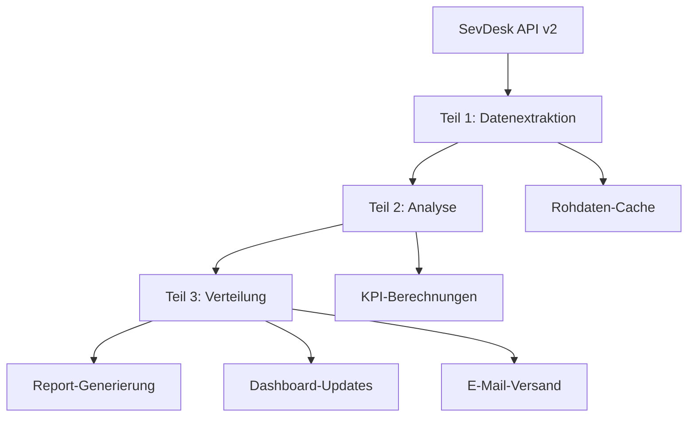

# Reporting - Umfassendes Business Intelligence Dashboard (v2)

Dieser Workflow erstellt automatisierte Reports und Business Intelligence Dashboards basierend auf SevDesk-Daten.

## Überblick

Das Reporting-System extrahiert, analysiert und visualisiert Geschäftsdaten aus SevDesk, um fundierte Entscheidungen zu unterstützen. Der Workflow besteht aus drei aufeinander aufbauenden Teilen:

1. **Teil 1: Datenextraktion** - Automatisierte Datensammlung aus SevDesk
2. **Teil 2: Analyse** - Berechnung von KPIs und Trends  
3. **Teil 3: Verteilung** - Erstellung und Versand von Reports

## Workflow-Architektur

## Unterstützte Report-Typen

### Finanzielle Reports
- **Umsatzberichte**: Monatliche und jährliche Umsatzentwicklung
- **Gewinn & Verlust**: GuV-Berichte mit Trend-Analysen
- **Cashflow-Analysen**: Liquiditätsplanung und -überwachung
- **Budgetvergleiche**: Ist-/Soll-Vergleiche und Abweichungsanalysen

### Kundenanalysen
- **Kundenumsätze**: Top-Kunden und Umsatzverteilung
- **Kundenakquise**: Neukundengewinnung und -entwicklung
- **Kundenbindung**: Wiederkaufsraten und Customer Lifetime Value
- **Zahlungsverhalten**: Zahlungsfristen und Ausfallrisiken

### Operationelle Reports
- **Projektanalysen**: Projektrentabilität und -status
- **Produktberichte**: Produktumsätze und Margen
- **Lieferantenanalysen**: Einkaufsvolumen und Konditionen
- **Steuerberichte**: Umsatzsteuer und steuerliche Kennzahlen

### Executive Dashboards
- **Management Dashboard**: Überblick über alle KPIs
- **Vertriebsdashboard**: Verkaufsleistung und Pipeline
- **Finanzdashboard**: Liquidität und finanzielle Gesundheit
- **Compliance Dashboard**: Steuer- und Rechtliches

## Technische Architektur

### Datenquellen
- **SevDesk API v2**: Primäre Datenquelle für alle Geschäftsdaten
- **Echtzeit-Integration**: Live-Daten für aktuelle Dashboards
- **Historische Daten**: Trend-Analysen über mehrere Jahre
- **Externe Daten**: Optional für Benchmarking und Marktvergleiche

### Verarbeitungskomponenten
- **ETL-Pipeline**: Extract, Transform, Load für Datenverarbeitung
- **KPI-Engine**: Berechnung von Geschäftskennzahlen
- **Visualisierungs-Engine**: Diagramm- und Dashboard-Erstellung
- **Distribution-Engine**: Automatischer Report-Versand

### Output-Formate
- **Interactive Dashboards**: Web-basierte Live-Dashboards
- **PDF-Reports**: Druckbare Berichte für Management
- **Excel-Exporte**: Datenexporte für weitere Analysen
- **E-Mail-Reports**: Automatischer Versand an Stakeholder

## Konfiguration

Die Workflow-Konfiguration erfolgt direkt in n8n und umfasst:

- `reportDefinitions`: Definition der verfügbaren Reports
  - `reportTypes`: Verschiedene Report-Kategorien
  - `kpiDefinitions`: Berechnung von Kennzahlen
  - `visualizationSettings`: Chart- und Dashboard-Konfiguration
  - `schedulingSettings`: Automatisierung von Report-Erstellung

- `dataSettings`: Datenverarbeitungs-Konfiguration
  - `sevdeskQueries`: Optimierte API-Abfragen
  - `cachingStrategy`: Daten-Caching für Performance
  - `aggregationRules`: Datengruppierung und -summierung
  - `calculationFormulas`: Formeln für KPI-Berechnungen

- `distributionSettings`: Verteilungs-Konfiguration
  - `recipientLists`: Empfänger für verschiedene Reports
  - `deliveryChannels`: E-Mail, Dashboard, Export
  - `formatSettings`: Ausgabeformate und -optionen
  - `accessControl`: Berechtigungen für Report-Zugriff

## Performance-Features

### Datenoptimierung
- **Intelligentes Caching**: Zwischenspeicherung häufig benötigter Daten
- **Inkrementelle Updates**: Nur geänderte Daten werden aktualisiert
- **Parallel Processing**: Gleichzeitige Verarbeitung verschiedener Reports
- **Data Compression**: Effiziente Speicherung großer Datenmengen

### Skalierbarkeit
- **Modular Design**: Erweiterbare Report-Module
- **Load Balancing**: Verteilung der Rechenlast
- **Auto-Scaling**: Automatische Anpassung an Datenvolumen
- **Resource Management**: Optimierte Nutzung von System-Ressourcen

## Monitoring und Qualitätssicherung

### Performance-Monitoring
- **Execution Times**: Überwachung der Report-Generierungszeiten
- **Data Freshness**: Aktualität der verwendeten Daten
- **Error Rates**: Fehlerquoten bei Datenabfragen und -verarbeitung
- **Resource Usage**: CPU, Memory und Storage Utilization

### Datenqualität
- **Data Validation**: Automatische Prüfung auf Dateninkonsistenzen
- **Anomaly Detection**: Erkennung ungewöhnlicher Datenmuster
- **Completeness Checks**: Vollständigkeitsprüfung der Datenextraktion
- **Accuracy Metrics**: Genauigkeitsmessungen für Berechnungen

## Integration und APIs

### SevDesk-Integration
- **Vollständige API v2-Abdeckung**: Zugriff auf alle relevanten Datenmodelle
- **Real-time Webhooks**: Sofortige Updates bei Datenänderungen
- **Bulk Data Operations**: Effiziente Verarbeitung großer Datenmengen
- **Error Handling**: Robuste Behandlung von API-Limits und -Fehlern

### External APIs
- **Export APIs**: Bereitstellung von Report-Daten für externe Systeme
- **Webhook Notifications**: Benachrichtigungen bei Report-Fertigstellung
- **REST Endpoints**: Programmatischer Zugriff auf Reports und Dashboards
- **Authentication**: Sichere API-Authentifizierung und -Autorisierung

## Business Intelligence Features

### Advanced Analytics
- **Trend-Analysen**: Automatische Erkennung von Geschäftstrends
- **Predictive Modeling**: Vorhersagen basierend auf historischen Daten
- **Comparative Analysis**: Vergleiche zwischen Zeiträumen und Segmenten
- **Drill-Down Capabilities**: Detailanalysen von aggregierten Daten

### Alerting System
- **Threshold Monitoring**: Benachrichtigungen bei Über-/Unterschreitung von Werten
- **Anomaly Alerts**: Warnungen bei ungewöhnlichen Datenmustern
- **Performance Alerts**: Benachrichtigungen bei Performance-Problemen
- **Custom Triggers**: Benutzerdefinierte Auslöser für spezielle Ereignisse

## Verbindung zu anderen Workflow-Teilen

- **Input**: Nutzt SevDesk-Daten aus allen Geschäftsbereichen
- **Integration**: Kann Daten aus anderen Workflows einbeziehen
- **Output**: Stellt Reports für Entscheidungsfindung und Compliance bereit

## Skalierbarkeit

- **Kleine Unternehmen**: 5-10 Standard-Reports mit täglichen Updates
- **Mittlere Unternehmen**: 20-50 Reports mit stündlichen Real-time Dashboards
- **Große Unternehmen**: 100+ Reports mit komplexen Analytics und Predictive Modeling
