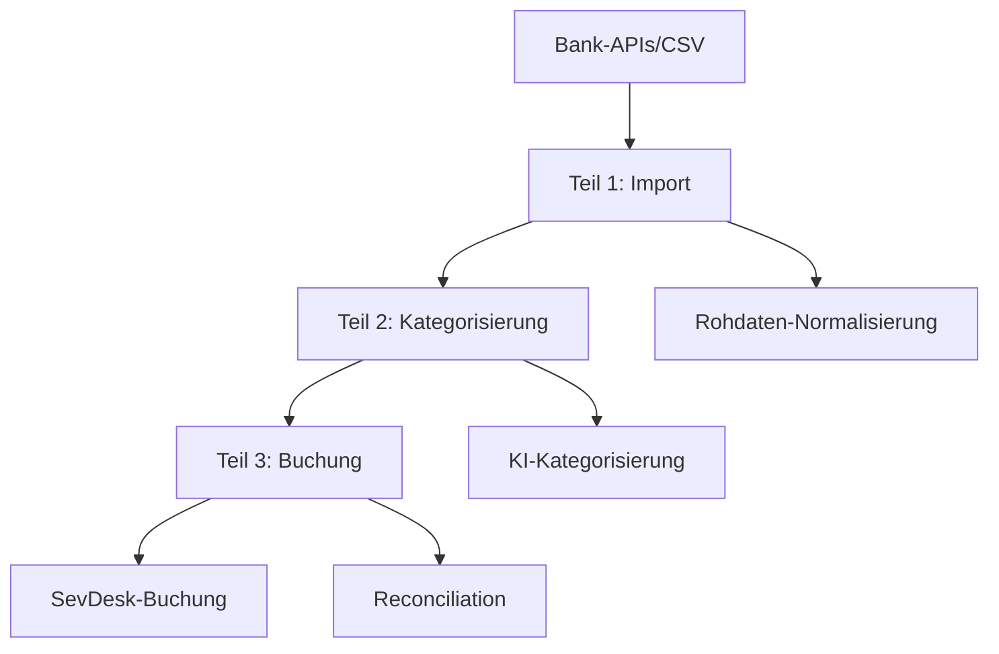

# Banktransaktionen - Automatisierte Verarbeitung und Zuordnung (v2)

Dieser Workflow automatisiert die Verarbeitung von Banktransaktionen und deren intelligente Zuordnung zu SevDesk-Datensätzen.

## Produktionsreife Modulare Struktur

Das Banktransaktions-System besteht aus drei separaten Teilen mit systematischen Node-IDs:

### **Teil 1: Import (Node-IDs: 051\_\***)\*\*

- **Zweck**: Automatisierter Import von Bankdaten aus verschiedenen Quellen
- **Webhook-Ausgang**: `webhook/bank-categorization`
- **Hauptnodes**: `051_TRG_01` (Schedule), `051_SVC_01` (Bank API), `051_FWD_01` (Forward)

### **Teil 2: Kategorisierung (Node-IDs: 052\_\***)\*\*

- **Zweck**: Intelligente Kategorisierung und Zuordnung von Transaktionen
- **Webhook-Eingang**: `webhook/bank-categorization`
- **Webhook-Ausgang**: `webhook/bank-booking`
- **Hauptnodes**: `052_TRG_01` (Webhook), `052_TRF_01` (ML Classification), `052_FWD_01` (Forward)

### **Teil 3: Buchung (Node-IDs: 053\_\***)\*\*

- **Zweck**: Automatische Verbuchung in SevDesk und Reconciliation
- **Webhook-Eingang**: `webhook/bank-booking`
- **Hauptnodes**: `053_TRG_01` (Webhook), `053_SVC_01` (SevDesk API), `053_OUT_01` (Output)

### **Vorteile der systematischen Node-IDs:**

- **Finanzielle Compliance** durch eindeutige Nachverfolgung aller Transaktionen
- **Automatisierte Reconciliation** mit klaren Verarbeitungsschritten
- **Machine Learning Integration** für verbesserte Kategorisierung
- **Skalierbare Verarbeitung** großer Transaktionsvolumen ohne Namenskonflikte

## Workflow-Architektur

## Unterstützte Datenquellen

### Bankverbindungen

- **HBCI/FinTS**: Direkte Bankverbindung zu deutschen Banken
- **PSD2-APIs**: Open Banking APIs europäischer Banken
- **CSV-Import**: Manuelle Kontoauszüge im CSV-Format
- **Excel-Import**: Strukturierte Bankdaten aus Excel-Dateien

### Kreditkartenanbieter

- **VISA/Mastercard**: Direkte API-Verbindungen
- **Amex**: American Express Datenimport
- **Corporate Cards**: Firmenkreditkarten-Systeme
- **Expense Management**: Integration mit Spesenabrechnungssystemen

### Payment-Provider

- **PayPal**: Transaktionsdaten via API
- **Stripe**: Payment-Daten für Online-Geschäfte
- **Square**: POS und Online-Zahlungen
- **Klarna**: Buy-now-pay-later Transaktionen

## Funktionalitäten

### Automatisierter Import

- **Scheduled Fetching**: Regelmäßiger automatischer Datenabruf
- **Real-time Webhooks**: Sofortige Benachrichtigung bei neuen Transaktionen
- **Batch Processing**: Effiziente Verarbeitung großer Datenmengen
- **Duplicate Detection**: Automatische Erkennung von Duplikaten

### Intelligente Kategorisierung

- **Machine Learning**: Lernende Algorithmen für Kategorisierung
- **Pattern Recognition**: Erkennung wiederkehrender Transaktionsarten
- **Rule-based Classification**: Konfigurierbare Geschäftsregeln
- **Manual Review Queue**: Manuelle Überprüfung unklarer Fälle

### Automatische Buchung

- **SevDesk Integration**: Direkte Buchung in SevDesk-Konten
- **Account Mapping**: Automatische Kontozuordnung
- **Tax Handling**: Steuerliche Behandlung verschiedener Transaktionstypen
- **Project Assignment**: Zuordnung zu Projekten und Kostenstellen

## Konfiguration

Die Workflow-Konfiguration erfolgt direkt in n8n und umfasst:

- `bankConnections`: Bank-Verbindungs-Konfiguration

  - `connectionTypes`: HBCI, API, CSV, Excel
  - `credentials`: Sichere Speicherung von Zugangsdaten
  - `schedules`: Zeitpläne für automatischen Import
  - `dataFilters`: Filter für relevante Transaktionen

- `categorizationRules`: Kategorisierungs-Regeln

  - `mlModels`: Machine Learning Modelle
  - `businessRules`: Geschäftsspezifische Zuordnungsregeln
  - `keywordMapping`: Schlüsselwort-basierte Kategorisierung
  - `amountRanges`: Betragsbasierte Kategorisierung

- `bookingSettings`: Buchungs-Konfiguration

  - `accountMapping`: Zuordnung zu SevDesk-Konten
  - `taxSettings`: Steuerliche Behandlung
  - `projectRules`: Projektzuordnungsregeln
  - `approvalWorkflows`: Freigabeprozesse

- `reconciliationSettings`: Abgleich-Konfiguration
  - `matchingCriteria`: Kriterien für automatischen Abgleich
  - `tolerances`: Toleranzen für Betragsabweichungen
  - `timeWindows`: Zeitfenster für Transaktionsabgleich
  - `manualReviewRules`: Regeln für manuelle Überprüfung

## Transaktionstypen

### Eingangsrechnungen

- **Lieferantenzahlungen**: Automatische Zuordnung zu offenen Verbindlichkeiten
- **Recurring Payments**: Wiederkehrende Zahlungen (Miete, Versicherungen)
- **Utility Bills**: Nebenkosten und Betriebsausgaben
- **Professional Services**: Beratung, Rechtsanwälte, Steuerberater

### Kundeneinzahlungen

- **Invoice Payments**: Zahlungen auf offene Forderungen
- **Advance Payments**: Vorauszahlungen und Anzahlungen
- **Refunds**: Rückerstattungen und Stornobuchungen
- **Subscription Payments**: Abonnement- und Mitgliedsbeiträge

### Interne Transaktionen

- **Salary Payments**: Gehaltszahlungen und Lohnnebenkosten
- **Inter-company Transfers**: Konzernverrechnungen
- **Capital Movements**: Kapitalerhöhungen und -rückzahlungen
- **Investment Transactions**: Wertpapier- und Anlagetransaktionen

### Gebühren und Kosten

- **Bank Fees**: Kontoführungsgebühren und Transaktionskosten
- **Card Fees**: Kreditkartengebühren
- **Foreign Exchange**: Währungsumrechnungen und Wechselkursgebühren
- **Interest**: Zinserträge und -aufwendungen

## Performance-Features

### Datenverarbeitung

- **Stream Processing**: Echtzeit-Verarbeitung eingehender Transaktionen
- **Batch Optimization**: Optimierte Stapelverarbeitung
- **Parallel Processing**: Gleichzeitige Verarbeitung verschiedener Konten
- **Data Compression**: Effiziente Speicherung historischer Daten

### Skalierbarkeit

- **Auto-scaling**: Automatische Anpassung an Transaktionsvolumen
- **Load Balancing**: Verteilung der Verarbeitungslast
- **Caching**: Zwischenspeicherung häufig benötigter Daten
- **Database Optimization**: Optimierte Datenbankabfragen

## Monitoring und Kontrolle

### Performance-Monitoring

- **Processing Speed**: Verarbeitungsgeschwindigkeit von Transaktionen
- **Success Rates**: Erfolgsquoten bei Import und Kategorisierung
- **Error Tracking**: Verfolgung und Analyse von Fehlern
- **System Health**: Überwachung der Systemleistung

### Business Intelligence

- **Categorization Accuracy**: Genauigkeit der automatischen Kategorisierung
- **Processing Volume**: Verarbeitetes Transaktionsvolumen
- **Manual Review Rates**: Anteil manuell zu prüfender Transaktionen
- **Cost Savings**: Eingesparte Zeit und Kosten durch Automatisierung

### Compliance Monitoring

- **Audit Trails**: Vollständige Nachverfolgung aller Transaktionen
- **Regulatory Compliance**: Einhaltung bankrechtlicher Vorschriften
- **Data Privacy**: DSGVO-konforme Datenverarbeitung
- **Security Monitoring**: Überwachung der Datensicherheit

## Integration und APIs

### SevDesk-Integration

- **Real-time Booking**: Sofortige Buchung in SevDesk
- **Account Synchronization**: Synchronisation von Kontenplänen
- **Invoice Matching**: Automatischer Abgleich mit offenen Rechnungen
- **Project Integration**: Verknüpfung mit SevDesk-Projekten

### Bank-APIs

- **PSD2 Compliance**: Einhaltung der Payment Services Directive
- **Strong Authentication**: Sichere Authentifizierung bei Banken
- **Multi-Banking**: Unterstützung mehrerer Bankverbindungen
- **Transaction Categories**: Nutzung von Bank-Kategorisierungen

### Third-Party-Integrations

- **Accounting Software**: Integration mit anderen Buchhaltungssystemen
- **ERP Systems**: Anbindung an Enterprise Resource Planning
- **Expense Management**: Integration mit Spesenabrechnungssystemen
- **Tax Software**: Verbindung zu Steuersoftware

## Machine Learning Features

### Kategorisierung

- **Supervised Learning**: Lernen aus manuellen Korrekturen
- **Natural Language Processing**: Textanalyse von Verwendungszwecken
- **Pattern Recognition**: Erkennung von Transaktionsmustern
- **Ensemble Methods**: Kombination verschiedener ML-Modelle

### Anomaly Detection

- **Fraud Detection**: Erkennung ungewöhnlicher Transaktionen
- **Outlier Analysis**: Identifikation von Ausreißern
- **Behavioral Analysis**: Analyse von Transaktionsverhalten
- **Risk Assessment**: Bewertung von Transaktionsrisiken

## Sicherheit und Compliance

### Datensicherheit

- **End-to-End Encryption**: Verschlüsselung aller Bankdaten
- **Secure Storage**: Sichere Speicherung sensibler Informationen
- **Access Control**: Granulare Zugriffskontrolle
- **Data Masking**: Maskierung von Kontodaten in Logs

### Regulatory Compliance

- **GDPR/DSGVO**: Datenschutz-Grundverordnung
- **PCI DSS**: Payment Card Industry Standards
- **SOX Compliance**: Sarbanes-Oxley Act Requirements
- **Local Banking Laws**: Lokale Bankengesetze

## Verbindung zu anderen Workflow-Teilen

- **Input**: Bankdaten von verschiedenen Quellen und APIs
- **Integration**: Vollständige SevDesk-Integration für Buchungen
- **Output**: Gebuchte Transaktionen und Reconciliation-Reports
- **Cross-Reference**: Verknüpfung mit Rechnungsstellung und Mahnwesen

## Produktionsreife Workflow-Dateien

Das Banktransaktions-System besteht aus drei separaten n8n-Workflows mit systematischen Node-IDs:

### **Teil 1: `Teil1-Import/import.json`**

- **Bankdaten-Import und -normalisierung**
- **Node-ID-Schema**: `051_*` (Kategorie 05, Teil 1)
- **Webhook-Ausgang**: `webhook/bank-categorization`
- **Status**: ✅ Produktionsbereit

### **Teil 2: `Teil2-Kategorisierung/kategorisierung.json`**

- **ML-basierte Transaktionskategorisierung**
- **Node-ID-Schema**: `052_*` (Kategorie 05, Teil 2)
- **Webhook-Eingang**: `webhook/bank-categorization`
- **Webhook-Ausgang**: `webhook/bank-booking`
- **Status**: ✅ Produktionsbereit

### **Teil 3: `Teil3-Buchung/buchung.json`**

- **SevDesk-Buchung und Reconciliation**
- **Node-ID-Schema**: `053_*` (Kategorie 05, Teil 3)
- **Webhook-Eingang**: `webhook/bank-booking`
- **Status**: ✅ Produktionsbereit

### **Konfigurationshinweise:**

- **Webhook-URLs**: Anpassung an Ihre n8n-Installation erforderlich
- **API-Credentials**: Bank-APIs, SevDesk, ML-Services
- **Kategorisierungsregeln**: Unternehmensspezifische Transaktionsklassifizierung
- **Node-IDs**: Bereits systematisch implementiert - keine Änderungen erforderlich

## Skalierbarkeit

- **Kleine Unternehmen**: 100-1.000 Transaktionen/Monat mit Basis-Kategorisierung
- **Mittlere Unternehmen**: 1.000-10.000 Transaktionen/Monat mit ML-Enhancement
- **Große Unternehmen**: 10.000+ Transaktionen/Monat mit Enterprise-Features und Multi-Banking
